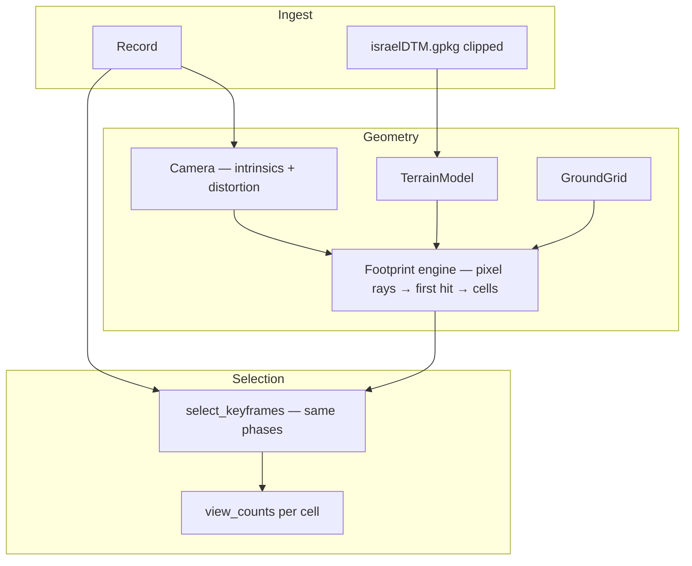

# DTM-Backed Frustum Selection Plan

Selection policy `frustum_view_count_dtm`: true camera geometry intersected with
the national DTM, scored by the same greedy view-count selector the pipeline
already uses.

**Terrain asset:** `/data/geo-resources/DSM/israelDTM.gpkg` (EPSG:32636, ~25 m,
GEOID heights).

---

## Summary

Each frame's footprint is computed by **ray-marching a dense grid of image
pixels to their first intersection with the DTM**. The set of ground cells those
rays land in *is* the footprint. Because every ray stops at the first terrain it
hits, occlusion behind ridges, horizon truncation, and footprints that wrap over
slope breaks are all represented exactly — no analytic quad, no flat-ground
assumption.

Selection maximizes **views per cell** over the **mission ground region** (the
union of every reachable frame's footprint), targeting dense multi-view coverage
before the keyframe budget runs out. The selector phases, scoring weights, and
cluster/temporal structure are unchanged; only the footprint engine and the
coverage denominator are new.

---

## End-to-end pipeline

```text
Record (video, poses CSV, intrinsicK.csv)
  → score all frames → candidates_scored.csv
  → Camera.from_record(record)
  → TerrainModel.from_gpkg(israelDTM.gpkg, bbox=mission_bbox)   # build-time clip
  → GroundGrid.from_poses(candidates, bin_size_m=5)
  → footprint cache: ray-march every candidate once (persisted on slug)
  → select_keyframes(candidates, camera, terrain, grid, params)
  → coverage metrics (covered-union + mission denominators)
  → health + selection_report + odm_input export
```



### Build CLI

```bash
scene-recon build <record> \
  --terrain-gpkg /data/geo-resources/DSM/israelDTM.gpkg
```

Persist in `selection_constants`: `policy`, `terrain_gpkg`, `camera_id`,
`datum_offset_m`, `ray_grid`, `bin_size_m`.

---

## Module layout

```text
src/scene_recon/
  camera.py              # Camera: intrinsic model authority — projection,
                         #   Brown-Conrady (forward + inverse), ODM entry
  geometry/
    extrinsics.py        # CameraPose, body→ENU convention, world_rays()
    terrain.py           # TerrainModel: clipped DTM array + affine + datum offset
    raymarch.py          # vectorized DDA + secant refine: rays → first-hit points
    footprint.py         # the engine: pixel grid → ground hits → cells/area/wkt
  selection/
    footprint.py         # read-through GroundFootprint cache; lean .cells for selector
    grid.py              # GroundGrid: single UTM-anchored cell identity
    selector.py          # SelectionState gains camera + terrain + grid
    metrics.py           # same gain semantics; dual coverage denominators
    params.py            # policy + terrain/datum/ray params
```

`camera.py` owns everything that derives from the intrinsic model — pixel↔ray
projection, distortion, and the ODM `cameras.json` entry — because those are one
concern. Terrain and ray-marching live in `geometry/`; the camera never knows
about the world. `geometry/footprint.py` is the physics engine;
`selection/footprint.py` is the thin caching adapter the selector talks to.

---

## `Camera` — intrinsic model authority

```python
# scene_recon/camera.py

@dataclass(frozen=True)
class Camera:
    fx: float
    fy: float
    cx: float
    cy: float
    k1: float
    k2: float
    p1: float
    p2: float
    k3: float
    width: int
    height: int

    @classmethod
    def from_csv(cls, path: Path, *, width: int, height: int) -> Camera: ...

    @classmethod
    def from_record(cls, record: Record) -> Camera:
        w, h = video_frame_size(record.video)
        return cls.from_csv(record.intrinsics, width=w, height=h)

    # --- geometry (vectorized, numpy in / numpy out) ---

    def sample_grid(self, shape: tuple[int, int]) -> np.ndarray:
        """(N, 2) pixel coords spanning the image, default ~48x27 (16:9)."""

    def pixels_to_rays(self, pixels: np.ndarray) -> np.ndarray:
        """(N, 2) pixels → (N, 3) unit rays in the camera frame.

        Applies inverse Brown-Conrady (via cv2.undistortPoints) so edge rays —
        which set the footprint boundary — are physically correct, not pinhole.
        """

    def project(self, points_cam: np.ndarray) -> np.ndarray:
        """(N, 3) camera-frame points → (N, 2) pixels. Forward model for tests."""

    # --- ODM export (behaviour identical to today's CameraIntrinsics) ---

    def camera_id(self) -> str: ...
    def to_odm_entry(self) -> dict[str, object]: ...
```

`intrinsics.py` re-exports `Camera`'s ODM helpers so `write_cameras_json` and the
existing ODM normalization tests keep passing byte-for-byte. Distortion is part
of v1, not deferred: the footprint edge is set by the most-distorted pixels, so a
pinhole model would give the wrong footprint shape exactly where it matters.

---

## Extrinsics and frame convention

```python
# scene_recon/geometry/extrinsics.py
# The module docstring is the convention spec: body frame, roll→pitch→yaw order,
# +Z optical axis, ENU output. One page, authoritative.

@dataclass(frozen=True)
class CameraPose:
    easting: float
    northing: float
    alt_m: float            # altamsl; corrected to the DTM datum via terrain
    roll_rad: float
    pitch_rad: float
    yaw_rad: float

    @classmethod
    def from_row(cls, row: pd.Series) -> CameraPose: ...

    def R_cam_to_enu(self) -> np.ndarray:   # (3, 3)
    def origin_enu(self) -> np.ndarray:     # (3,) [e, n, alt]


def world_rays(
    camera: Camera,
    pose: CameraPose,
    pixels: np.ndarray,     # (N, 2)
) -> tuple[np.ndarray, np.ndarray]:
    """Returns (origins (N,3), directions (N,3)) in ENU/UTM."""
```

Roll is honoured (the prior flat-plane model dropped it). The convention is
locked down by golden tests:

- **Cross-check:** at nadir with zero roll, `world_rays` + intersection must
  reproduce the ground point of the previous validated yaw/pitch convention to a
  tight tolerance — this prevents a silent convention swap.
- **Oblique + roll:** a hand-computed flat-plane intersection for a tilted,
  rolled pose.
- **Visual overlay** of one real flight's footprints on the trajectory map as the
  integration gate.

---

## Footprint engine

```python
# scene_recon/geometry/footprint.py

def ground_footprint(
    camera: Camera,
    pose: CameraPose,
    terrain: TerrainModel,
    grid: GroundGrid,
    *,
    ray_grid: tuple[int, int] = (48, 27),
) -> GroundFootprint:
    pixels = camera.sample_grid(ray_grid)
    origins, dirs = world_rays(camera, pose, pixels)
    hits, valid = raymarch_first_hit(origins, dirs, terrain)
    cells = grid.cells_for_points(hits[valid])
    return GroundFootprint(cells=cells, hits=hits[valid], valid_frac=valid.mean(), ...)
```

```python
@dataclass(frozen=True)
class GroundFootprint:
    frame_number: int
    cells: frozenset[tuple[int, int]]
    valid: bool                  # valid_frac >= params.min_valid_ray_frac
    valid_frac: float
    # report-only, computed lazily from `hits`:
    polygon_wkt: str             # convex hull of hit points; no shapely (f-string)
    area_m2: float               # len(cells) * bin_size_m**2
    centroid_e: float
    centroid_n: float
    reject_detail: str | None    # too_few_hits, all_nodata, below_horizon
```

The selector only ever reads `.cells` and `.valid`, so the hot path stays as lean
as a tuple; WKT/centroid are materialized only when the audit CSV is written.

Everything the old quad model needed special cases for is now intrinsic:

| Concern | How the engine handles it |
|---------|---------------------------|
| Occlusion behind ridges | First-hit march: blocked ground is never added to `cells` |
| Horizon / up-looking rays | Ray never descends below terrain → that ray is invalid |
| Slope-break / non-convex footprints | Cells come from real hit points, not a fitted quad |
| Slant-range limit | `max_range_m` cap on the march (replaces `max_slant_m`) |
| Degenerate footprint | `valid_frac < min_valid_ray_frac` → `invalid_footprint` reject |

---

## Ray–terrain intersection

```python
# scene_recon/geometry/raymarch.py

def raymarch_first_hit(
    origins: np.ndarray,        # (N, 3)
    directions: np.ndarray,     # (N, 3) unit, ENU
    terrain: TerrainModel,
    *,
    step_m: float = 10.0,
    max_range_m: float = 2000.0,
    refine_iters: int = 4,
) -> tuple[np.ndarray, np.ndarray]:   # (N, 3) hit points, (N,) valid
    """March each ray at fixed step; detect the FIRST sign change of
    (ray_z - terrain_z); secant-refine within that bracket. Vectorized over all
    rays of a frame.

    valid=False when the ray never crosses (horizon/up-looking), every sample is
    nodata, or no crossing within max_range_m.
    """
```

- **First crossing only** — occlusion correctness depends on taking the nearest
  bracket along the ray, not the global minimum.
- `step_m` is tied to DTM resolution; sub-step precision comes from the secant
  refine rather than a tiny step.
- `nodata` samples (NaN from `elevation_at`) don't terminate the march; an
  all-NaN path is invalid.

`ponytail:` fixed-step marching can skip a terrain spike thinner than `step_m`.
Acceptable on bare-earth DTM; upgrade path is adaptive (cone/maximum-mipmap)
stepping if the DSM is ever used.

---

## Terrain model

```python
# scene_recon/geometry/terrain.py

class TerrainModel:
    array: np.ndarray           # float32, clipped to mission bbox + margin
    affine: Affine
    nodata: float
    datum_offset_m: float

    @classmethod
    def from_gpkg(
        cls,
        path: Path,
        *,
        bbox_utm: tuple[float, float, float, float],
        margin_m: float = 500.0,
        datum_offset_m: float = 0.0,
    ) -> TerrainModel: ...

    def elevation_at(self, easting: np.ndarray, northing: np.ndarray) -> np.ndarray:
        """Bilinear sample + datum_offset_m; nodata → np.nan."""

    @property
    def crs(self) -> str: ...    # "EPSG:32636"
```

`rasterio` (GDAL) is used **only** at build time to clip the national DTM to the
mission bbox; the clip is persisted next to the slug cache as `.npy` + an affine
JSON, so the selection/report runtime and the Docker image need no GDAL.

**Datum:** the DTM is `HEIGHT_REFERENCE=GEOID`; poses carry `altamsl`. Measure the
offset on one known point during the first build, store `datum_offset_m` in
`selection_constants`, and apply it in `elevation_at`. Geoid undulation varies
slowly enough across a mission that a single constant is sound.

---

## Ground grid and coverage

```python
# scene_recon/selection/grid.py

class GroundGrid:
    bin_size_m: float
    origin_e: float             # UTM-anchored: floor(min_easting / bin) * bin
    origin_n: float

    @classmethod
    def from_poses(cls, candidates: pd.DataFrame, *, bin_size_m: float,
                   margin_m: float) -> GroundGrid: ...

    def cells_for_points(self, points: np.ndarray) -> frozenset[tuple[int, int]]:
        """(N, 2|3) ENU points → deduped (cell_x, cell_y) via floor((p-origin)/bin)."""

    def mission_cells(self, footprints: Iterable[GroundFootprint]) -> frozenset[tuple[int, int]]:
        """Union of every candidate footprint — the mission denominator."""
```

`GroundGrid` is the single source of cell identity. Every cell id — in selection,
in coverage, and in the audit's `cell_x`/`cell_y` columns — comes from this one
object and one fixed origin.

### View counts (unchanged semantics)

```python
view_counts: dict[tuple[int, int], int]

gain(frame) = |{ c ∈ frame.cells : view_counts[c] < target_views_per_cell }|
```

### Coverage metrics (two denominators)

Both denominators are reported in every run, so the policy is self-validating: the
covered-union number is directly comparable to the prior flat policy, while the
mission number is the honest target.

| Field | Meaning |
|-------|---------|
| `n_cells_mission` | cells in the mission region (all candidate footprints) |
| `n_cells_covered` | cells with ≥ 1 view (selected union) |
| `n_cells_at_target` | cells with ≥ target views |
| `pct_covered_at_target` | `n_cells_at_target / n_cells_covered` |
| `pct_mission_at_target` | `n_cells_at_target / n_cells_mission` |
| `mean_views_per_covered_cell` | as before |
| `views_histogram` | as before |
| `selected_union_area_m2` | `n_cells_covered * bin_size_m**2` |

Health fails when `pct_mission_at_target < min_pct_mission_at_target` (this
threshold is calibrated against the first baseline run — the mission denominator
is strictly larger than the covered one, so it is not the old 0.7).

---

## Footprint cache (persistent)

The mission denominator requires a footprint for **every** candidate, not just the
selected pool. Ray-march each candidate once and persist `{frame: cells}` next to
`candidates_scored.csv`, keyed by `(camera_id, terrain_hash, pose_hash,
ray_grid, bin_size_m)`. Re-selection with different selector params, or
`report --force`, reuses the cache; only a camera/terrain/grid change invalidates
it. The in-memory cache on `SelectionState` is a read-through layer over this.

---

## Frame ↔ ground association (audit)

Audit CSV column additions:

- `footprint_polygon_wkt`
- `footprint_valid`
- `footprint_valid_frac`
- `footprint_terrain_source` = `"israelDTM.gpkg"`

---

## Selection state

```python
@dataclass
class SelectionState:
    out: pd.DataFrame
    params: SelectionParams
    camera: Camera
    terrain: TerrainModel
    grid: GroundGrid
    mission_cells: frozenset[tuple[int, int]]
    view_counts: dict[tuple[int, int], int]
    footprint_cache: dict[int, GroundFootprint]
    # ball_index, selected, selected_order — unchanged
```

The flat-plane `ground_altitude_m` field is removed; ground height comes from the
terrain everywhere, which also removes the prior inconsistency where selection and
the report inferred two different ground planes.

### Phases (unchanged)

| Phase | `selection_reason` | Notes |
|-------|---------------------|-------|
| seed | `temporal_seed` | |
| chain | `temporal_chain` | |
| coverage fill | `coverage_gain` | `require_coverage=True` |
| budget fill | `budget_fill` | |
| filter | — | main spatial component |
| reject pass | — | + `invalid_footprint` |

### Reject reasons

- `invalid_footprint` — too few valid rays, all nodata, or below-horizon frame
- `coverage_saturated`, `low_coverage_gain`, `low_pose_novelty`,
  `spatial_cluster_cap`, `outlier_component`, `max_keyframes` — unchanged

---

## `SelectionParams`

```python
SELECTION_POLICY = "frustum_view_count_dtm"

@dataclass(frozen=True)
class SelectionParams:
    bin_size_m: float = 5.0
    terrain_gpkg: Path | None = None        # required for DTM builds
    datum_offset_m: float = 0.0
    ray_grid: tuple[int, int] = (48, 27)
    max_range_m: float = 2000.0
    min_valid_ray_frac: float = 0.25
    target_views_per_cell: int = 5
    min_pct_mission_at_target: float = 0.5  # calibrated from baseline
    # temporal / cluster / scoring weights — unchanged
    # removed: footprint_half_width_scale, footprint_half_depth_scale, min_agl_m
```

---

## Report artifacts

| File | Content |
|------|---------|
| `views_per_cell.png` | DTM-frustum view-count heatmap |
| `view_diversity.png` | per-cell viewing-angle spread (geometry, not count) |
| `views_histogram.png` | views-per-cell distribution |
| `trajectory_map.png` | poses + footprint samples |
| `selection_reason_map.png` | selected poses colored by `selection_reason` |
| `reject_map.png` | rejected candidates colored by `reject_reason` |
| `footprint_union.png` | mission region, selected union, under-target holes |
| `selection_summary.json` | coverage + decision breakdown + diversity (see below) |

---

## Selection insight

The report must explain not just *how good* the selection is but *why each frame
was chosen* and *what the geometry of the result is*. Aggregate coverage and gap
stats answer neither. Three layers, in priority order.

### Layer 1 — surface the decisions already computed

Every signal below already exists per-row in `selection_audit.csv`
(`selection_reason`, `coverage_gain_cells`, `selector_score`, `bin_rank`,
`distance/rotation_from_last_selected`); the selector just never aggregates them.
Add to `selection_summary.json`:

- `selection_reason_counts` — histogram of `selection_reason` over selected frames
  (the mirror of the existing `reject_counts`); shows how many picks were
  `coverage_gain` vs near-free `budget_fill`.
- `coverage_gain_by_reason` — quantiles of `coverage_gain_cells` per
  `selection_reason`; exposes how marginal the budget-fill tail was.
- `marginal_selections` — count + frame list where selected but
  `coverage_gain_cells == 0` (pure spacing/budget picks).
- `near_miss_rejects` — top-N rejected frames whose `selector_score` beat the
  lowest-scoring accepted frame in the same window (the counterfactual).
- `selected_bin_rank` — quantiles of `bin_rank` over selected; are we taking the
  best frame per cell or settling?

One selector change unlocks the score breakdown: store the three weighted terms
(`score_quality_term`, `score_coverage_term`, `score_novelty_term`) in
`write_debug_columns` instead of only their sum, then report
`score_term_means_by_reason`.

### Layer 2 — coverage quality beyond counts

View *count* is blind to redundancy, geometry, and where the gaps are. Using
`view_counts`, the grid, and the cell→frame inversion the footprint cache makes
available:

- **Coverage holes** — connected-components over under-target cells →
  `{n_cells, area_m2, centroid_e, centroid_n}` for the largest holes, plus
  `n_holes` and `total_hole_area_m2`. Turns "70% at target" into "the misses are
  these N patches, here." Feeds the `footprint_union.png` annotations.
- **Over-coverage** — `n_cells_over_2x_target`, `over_coverage_area_m2`, and
  frames whose footprint is fully redundant (every cell already ≥ target when
  added): the budget that could be reclaimed.
- **Per-cell view diversity** — invert footprints to `cell → [frames]`; per
  well-covered cell compute the spread of camera azimuths to the cell (or max
  pairwise convergence angle from camera positions + cell centroid). Report
  `mean_view_angle_spread_deg` quantiles and `cells_at_target_but_low_diversity`
  (≥ target views but angular spread below threshold). This catches the failure
  mode count cannot see — enough frames, degenerate geometry — and is the single
  most reconstruction-relevant signal in the report.

### Layer 3 — plots

`selection_reason_map.png`, `reject_map.png`, and `view_diversity.png` (table
above). The first two show whether decisions are spatially structured (e.g. a
whole low-altitude leg dropped); the third is the geometry-aware companion to
`views_per_cell.png`.

---

## Implementation phases

### Phase 1 — Camera + extrinsics

- [ ] `camera.py`: `from_csv`/`from_record`, `pixels_to_rays` (inverse
      Brown-Conrady via cv2), `project`, ODM helpers identical to today
- [ ] `intrinsics.py` re-exports ODM helpers; existing ODM tests pass unchanged
- [ ] `geometry/extrinsics.py`: `CameraPose`, `R_cam_to_enu`, `world_rays`
- [ ] Golden tests: nadir cross-check vs prior convention; oblique+roll case

### Phase 2 — Terrain + ray-march

- [ ] `TerrainModel.from_gpkg` build-time clip → persisted `.npy` + affine
- [ ] Datum offset measured and stored
- [ ] `raymarch_first_hit` vectorized; secant refine
- [ ] Tests: flat DTM nadir → rectangle; synthetic ridge → occlusion truncation;
      horizon ray → invalid

### Phase 3 — Engine, grid, selection

- [ ] `geometry/footprint.ground_footprint`; `GroundGrid` single cell identity
- [ ] Persistent footprint cache; `SelectionState` + `select_keyframes` wired
- [ ] Dual `CoverageMetrics`; health on `pct_mission_at_target`
- [ ] Policy, CLI `--terrain-gpkg`, `build.py` loads camera + terrain

### Phase 4 — Report + validate

- [ ] Audit WKT/valid columns; `footprint_union.png`
- [ ] Run `0088_20260122_eitan_1`; record both denominators; calibrate
      `min_pct_mission_at_target` from the result
- [ ] Visual footprint overlay confirms the pose convention

### Phase 5 — Selection insight

- [ ] Layer 1: store score terms in `write_debug_columns`; aggregate
      `selection_reason_counts`, `coverage_gain_by_reason`, `marginal_selections`,
      `near_miss_rejects`, `selected_bin_rank` into `selection_summary.json`
- [ ] Layer 2: coverage holes (connected components), over-coverage, per-cell
      view-angle diversity from the cell→frame inversion
- [ ] Layer 3: `selection_reason_map.png`, `reject_map.png`, `view_diversity.png`

---

## Risks

| Risk | Mitigation |
|------|------------|
| Pose convention wrong | Nadir cross-check + oblique golden tests + flight overlay |
| altamsl vs GEOID | Measure offset on a known point; store `datum_offset_m` |
| 25 m DTM vs 5 m bins | Coarse terrain accepted; secant refine; documented |
| Ray-march misses thin features | Bare-earth DTM; `ponytail:` ceiling noted in raymarch |
| All-candidate march cost | Persistent slug-level footprint cache |
| Docker can't see DTM | rasterio at build time only; runtime reads persisted clip |
